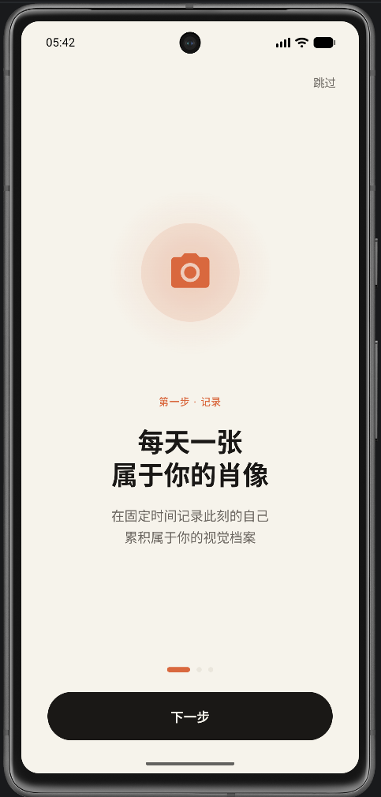
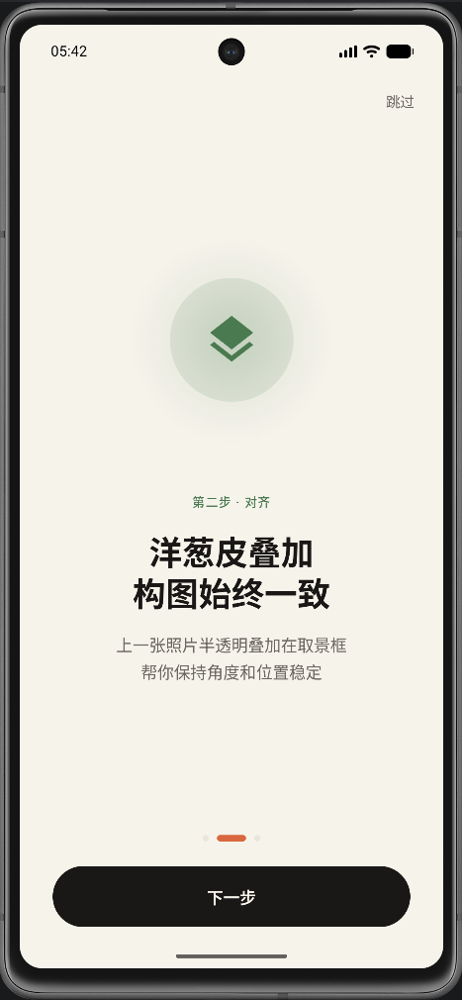
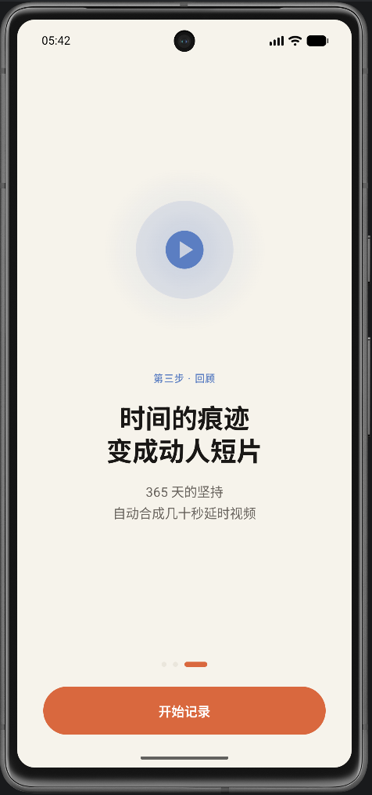
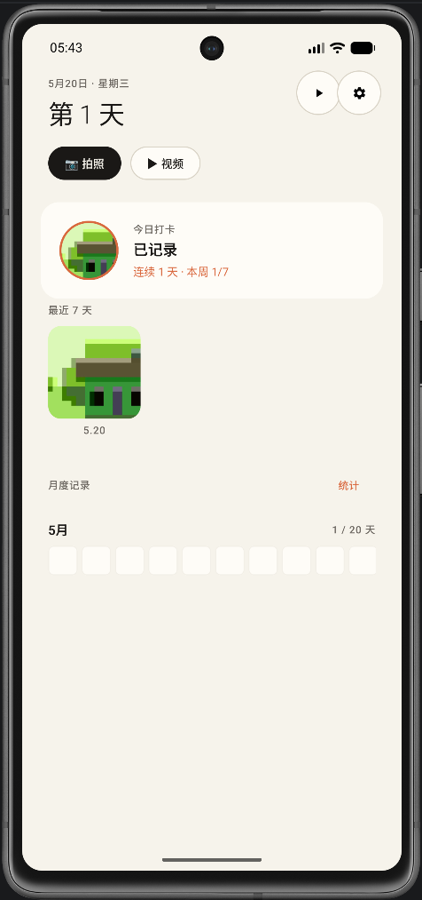
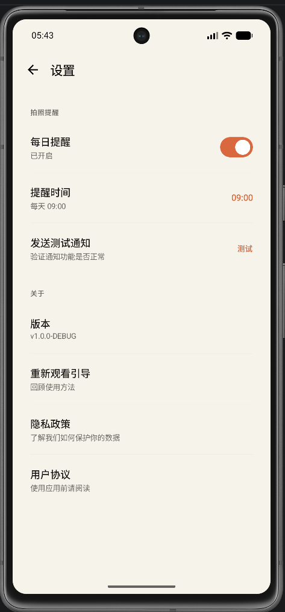

# DailyPortrait · 每日肖像

<p align="center">
  
  
  
</p>

<p align="center">
  
  
</p>

> 每天一张自拍，AI 辅助对齐，365 天后生成一部属于你的延时视频。

---

## 产品理念

DailyPortrait 是一款**离线优先**的每日肖像记录应用。核心价值：

- **一天一张**：用最小的行动成本，积累最大的时间价值
- **AI 对齐**：ML Kit 人脸识别实时引导构图，让每张照片里你的脸在同一位置
- **延时视频**：30 天 / 365 天的坚持，变成几十秒的动人短片
- **完全离线**：照片不上云、人脸不联网、视频本地生成

---

## 功能一览

| 功能 | 说明 |
|------|------|
| 📸 每日拍照 | 前置摄像头 + 洋葱皮叠加 + 实时对齐引导环 |
| 🔥 连续打卡 | 自动计算连续天数，断签清零 |
| 📅 周进度 | 7 天圆点可视化，一目了然 |
| 🎬 延时视频 | 帧率 / 画质 / 仅对齐照片可调，一键导出到系统相册 |
| 🔔 定时提醒 | 自定义时间，每天准时推送通知 |
| 🖼️ 照片浏览 | 左右滑动大图 + 删除可撤销 |
| 🌙 深色模式 | 跟随系统自动切换 |
| ♿ 无障碍 | TalkBack 全覆盖 + 触觉反馈 + 色盲友好 |

---

## 技术栈

| 层 | 技术 |
|----|------|
| UI | Jetpack Compose + Material 3 |
| 架构 | Clean Architecture + MVI |
| 依赖注入 | Hilt (Dagger) |
| 数据库 | Room + Flow |
| 相机 | CameraX |
| AI 视觉 | ML Kit Face Detection（静态版，完全离线） |
| 视频合成 | Media3 Transformer |
| 偏好存储 | DataStore |
| 图片加载 | Coil |
| 语言 | Kotlin 2.0 |

---

## 架构图

```
┌─────────────────────────────────────────────────────┐
│                    UI Layer                          │
│  Compose Screens + ViewModels (MVI)                 │
│  ┌──────────┐ ┌──────────┐ ┌──────────┐            │
│  │Dashboard │ │ Camera   │ │ Settings │            │
│  └──────────┘ └──────────┘ └──────────┘            │
├─────────────────────────────────────────────────────┤
│                  Domain Layer                        │
│  ┌──────────────┐ ┌──────────────┐                  │
│  │PhotoRepository│ │GenerateVideo │                  │
│  │  (interface)  │ │  UseCase     │                  │
│  └──────────────┘ └──────────────┘                  │
├─────────────────────────────────────────────────────┤
│                   Data Layer                         │
│  ┌────────┐ ┌───────────┐ ┌──────────────┐         │
│  │  Room  │ │FileManager│ │FaceAnalyzer  │         │
│  │  DAO   │ │(沙盒 IO)  │ │(ML Kit)      │         │
│  └────────┘ └───────────┘ └──────────────┘         │
│  ┌──────────────────┐ ┌──────────────────┐         │
│  │Media3VideoExporter│ │MediaStoreSaver   │         │
│  └──────────────────┘ └──────────────────┘         │
└─────────────────────────────────────────────────────┘
```

---

## 核心技术亮点

### 1. 人脸对齐算法

- ML Kit 每帧分析人脸 BoundingBox（<30ms）
- 归一化坐标（0~1）跨分辨率复用
- Chebyshev 距离判对齐（比欧式更严格，8% 阈值）
- 代际传递：每张照片的人脸位置作为下一张的对齐目标
- 结果：延时视频里人脸位置完全稳定，不抖动

### 2. 视频合成

- Media3 Transformer 把图片序列编码为 H.264 MP4
- 支持 4 档画质（720p ~ 4K）+ 帧率 2~20fps
- Foreground Service 保证后台合成不被杀
- 自动保存到系统相册（MediaStore API）

### 3. 可撤销删除

- 软删除 + 5 秒 Snackbar 撤销窗口
- 超时后才真删磁盘文件
- 避免误删不可逆

### 4. 隐私优先

- 所有照片仅存设备沙盒，卸载即清
- ML Kit 静态版，零网络请求
- 无广告、无追踪、无用户账号
- `allowBackup = false`，照片不上云备份

---

## 项目结构

```
android/
├── app/src/main/java/com/missyun/dailyportrait/
│   ├── data/           # Room + FileManager + ML Kit + Media3
│   ├── domain/         # Repository 接口 + UseCase + 纯函数工具
│   ├── ui/             # Compose Screens + Components + Theme
│   ├── service/        # VideoRenderService (Foreground)
│   └── di/             # Hilt Modules
├── app/src/test/       # 36 个单元测试
├── legal/              # 隐私政策 + 用户协议模板
├── docs/screenshots/   # 应用截图
└── GETTING-STARTED.md  # 零基础运行指南
```

---

## 快速开始

### 环境要求

- Android Studio Ladybug (2024.2+)
- JDK 17
- Android SDK 35
- 模拟器或 Android 8.0+ 真机

### 运行

```bash
git clone https://github.com/alinweii/DailyPortrait.git
cd DailyPortrait/android
```

用 Android Studio 打开 `android/` 文件夹 → Sync → Run。

详细步骤见 [GETTING-STARTED.md](android/GETTING-STARTED.md)。

### 运行测试

```bash
cd android
./gradlew test
```

---

## 下载体验

> 📦 [点击下载最新版 APK](https://github.com/alinweii/DailyPortrait/releases/latest/download/app-debug.apk)

安装方式：下载后传到 Android 手机，打开安装即可（需开启"允许安装未知来源"）。

> 💡 也可以在 [Releases 页面](https://github.com/alinweii/DailyPortrait/releases) 查看所有历史版本。

---

## 设计文档

| 文档 | 说明 |
|------|------|
| [设计交付文档](DailyPortrait-设计交付文档.md) | 产品设计规范 + WCAG 合规清单 |
| [架构说明书](android/architecture-android.md) | Android 技术架构 + 分步实现指令 |
| [A11y 验收清单](android/A11Y-CHECKLIST.md) | 12 大项无障碍验收 |
| [Release 指南](android/RELEASE-GUIDE.md) | 签名 + ProGuard + 上架准备 |
| [隐私政策](android/legal/PRIVACY-POLICY.md) | 隐私保护承诺 |

---

## 开发历程

这个项目从设计文档分析 → 3 套 HTML 原型 → Android 原生实现 → 系统性优化，
全程由 AI 辅助完成（Kiro + Claude），历时约 2 天。

开发过程中的关键决策：
- 选择 Soft Cloud 视觉系统（米色 + 焦糖橘），后升级为 Linen Journal 风格
- 人脸对齐用 Chebyshev 距离而非欧式距离
- 视频合成强制 H.264 编码（兼容性最佳）
- 删除走软删除 + 撤销（NNG H3 用户控制与自由）
- 日期水印功能暂未实装，移除假开关避免 dark pattern

---

## 路线图

- [ ] 视频日期水印（OverlayEffect 烧录文字到帧）
- [ ] 统计大图页（月度热力图 + 总览数据）
- [ ] 桌面 Widget 快捷拍照
- [ ] 云备份（WebDAV / 坚果云）
- [ ] iOS 版本（SwiftUI + Vision Framework）

---

## 许可证

本项目采用 [MIT License](LICENSE) 开源。

---

## 致谢

- [Jetpack Compose](https://developer.android.com/jetpack/compose) — 声明式 UI
- [ML Kit](https://developers.google.com/ml-kit) — 离线人脸识别
- [Media3](https://developer.android.com/media/media3) — 视频合成
- [Hilt](https://dagger.dev/hilt/) — 依赖注入
- [Coil](https://coil-kt.github.io/coil/) — 图片加载
- [Material 3](https://m3.material.io/) — 设计系统

---

<p align="center">
  <b>每天一张，记录时间的痕迹。</b>
</p>
